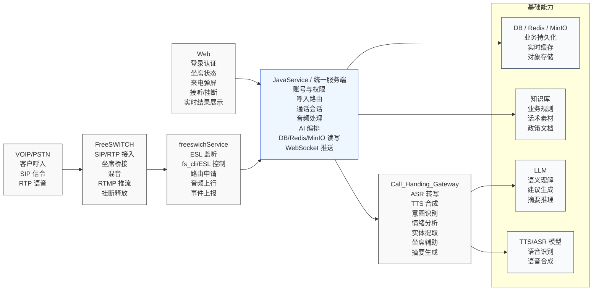
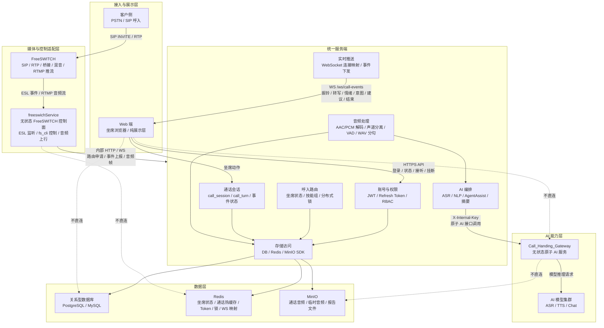
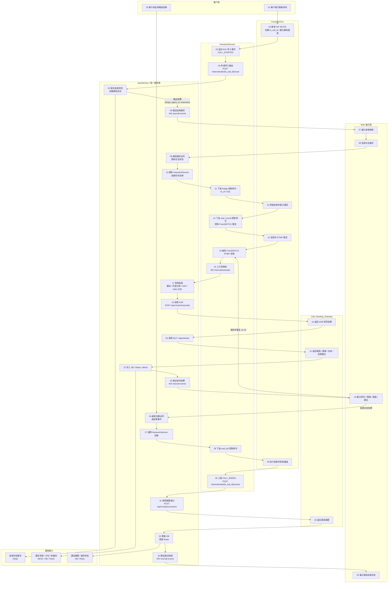

# 呼入链路工程化架构设计

> 目标：基于现有 `web-huawu-ts`、`freeswichService`、`Call_Handing_Gateway` 三个参考项目，重新设计工程化呼入链路。新增统一服务端作为唯一入口、状态中心、存储入口和业务编排层；`freeswichService` 与 `Call_Handing_Gateway` 降级为无状态服务；Web 端只负责展示与坐席操作。

## 1. 目标范围

本文档只描述核心呼入链路：客户呼入、坐席接听、通话中实时处理、挂断结束。

不在本文档展开：完整后台管理、外呼、报表、工单系统、知识库管理、机器人完整闭环、模型运维平台。

设计边界：

- 服务端统一管理账号、JWT、RBAC、通话会话、坐席状态、音频处理、AI 编排、DB/Redis/MinIO 访问。
- Web 端只保留登录态、页面展示、WebSocket 接收、坐席接听/挂断等操作入口。
- `freeswichService` 只负责 FreeSWITCH 控制、ESL 事件监听、路由申请、音频上行、事件上报和控制指令下发。
- `Call_Handing_Gateway` 只提供 ASR、NLP、AgentAssist、TTS 等原子 AI 接口。
- DB、Redis、MinIO 只允许统一服务端直接访问。

## 2. 服务功能点概览图

## 3. 分层架构图

## 4. 呼入流程图

## 5. 角色职责边界

| 角色 | 目标定位 | 负责 | 不负责 |
|---|---|---|---|
| 客户侧 | 呼叫发起方 | 拨打客服热线、发送/接收语音 | 业务状态、系统接口 |
| FreeSWITCH | 媒体引擎 | SIP/RTP、坐席桥接、混音、RTMP 推流、释放通道 | 路由决策、账号权限、DB/Redis、ASR/NLP |
| freeswichService | 无状态 FreeSWITCH 控制面 | ESL 监听、路由申请、fs_cli 控制、音频帧上行、结束事件上报 | 数据库存储、Redis 状态中心、VAD、ASR、NLP、坐席路由决策 |
| 统一服务端 | 唯一入口与状态中心 | JWT/RBAC、呼入路由、通话会话、音频处理、AI 编排、DB/Redis/MinIO、WS 推送 | SIP/RTP 媒体交换、模型推理实现 |
| Web 端 | 纯展示层 | 登录态、坐席操作、振铃/转写/建议/结束状态展示、音频播放 | PCM/WAV 封装、Protobuf 解码、ASR/NLP 调用、音频队列背压、业务计算 |
| Call_Handing_Gateway | 无状态原子 AI 服务 | ASR、NLP、AgentAssist、TTS、摘要等推理接口 | 通话持久化、用户隔离、权限校验、DB/Redis/MinIO 访问 |
| DB | 关系型持久化 | 用户、角色、权限、通话会话、分句、坐席状态落库 | 高频临时状态 |
| Redis | 实时状态与缓存 | 坐席状态、通话热缓存、Token 黑名单、WS 映射、限流、锁 | 不可替代的长期业务数据 |
| MinIO | 对象存储 | 通话分句音频、临时音频、报告文件 | 业务字段查询、权限判断 |

## 6. 核心接口清单

> 流程步骤对应 `## 4. 呼入流程图` 中的节点编号。Web 端对服务端使用 `Authorization: Bearer <access_token>`；内部服务调用使用 `X-Internal-Key`。接口地址为目标工程化设计，可在落地时按服务注册名和网关前缀调整。
>
> DB / Redis / MinIO 属于服务端内部数据访问能力，不对 Web、freeswichService、Call_Handing_Gateway 暴露。

| 流程步骤 | 接口地址 | 作用 | 提供者 | 使用者 | 输入 | 输出 |
|---:|---|---|---|---|---|---|
| 04-05 | `POST /internal/calls/{fs_call_id}/route` | 呼入路由申请，服务端创建通话会话并选择可接听坐席 | JavaService / 统一服务端 | freeswichService | Path: `fs_call_id`；JSON: `customer_phone`, `called_number`, `skill_group`, `fs_metadata`；Header: `X-Internal-Key` | `call_session_id`, `route_action`, `target_agent_id`, `target_extension`, `ring_timeout_sec` |
| 06-07 | `WS /ws/call-events` | 向目标坐席推送来电振铃和弹屏数据 | JavaService / 统一服务端 | Web 展示端 | WS 连接携带 JWT；服务端按 `agent_id` 查找连接 | JSON: `type=ringing`, `call_session_id`, `customer_phone`, `called_number`, `skill_group` |
| 08-10 | `POST /api/v1/calls/{id}/actions` | 坐席提交接听动作，服务端更新会话状态并准备通知 freeswichService | JavaService / 统一服务端 | Web 展示端 | Path: `id`；JSON: `action=accept`；Header: `Authorization` | `success`, `call_session_id`, `status=answered`, `accepted_at` |
| 10-12 | `POST http://freeswich-service/api/v1/calls/action` | 服务端请求 freeswichService 下发 bridge 控制命令，由 FreeSWITCH 桥接坐席 | freeswichService | JavaService / 统一服务端 | JSON: `action=bridge`, `fs_call_id`, `call_session_id`, `target_extension`；Header: `X-Internal-Key` | `success`, `fs_call_id`, `command=bridge`, `command_result` |
| 13-15 | `POST http://freeswich-service/api/v1/calls/action` | 服务端请求 freeswichService 下发 `uuid_record` 控制命令，由 FreeSWITCH 混音并 RTMP 推流 | freeswichService | JavaService / 统一服务端 | JSON: `action=start_streaming`, `fs_call_id`, `call_session_id`, `rtmp_url`, `stream_options`；Header: `X-Internal-Key` | `success`, `fs_call_id`, `command=uuid_record`, `stream_status` |
| 16-17 | `WS /internal/ws/audio` | freeswichService 将接收到的 FreeSWITCH 音频帧上行给服务端处理 | JavaService / 统一服务端 | freeswichService | Binary/Protobuf: `fs_call_id`, `call_session_id`, `sequence`, `codec`, `sample_rate`, `channels`, `payload`, `is_last`；Header: `X-Internal-Key` | WS ACK: `sequence`, `accepted`, `reason` |
| 18-19 | `POST /api/v1/asr/transcribe` | 服务端将切分后的 WAV 分句提交给 AI 网关做 ASR 转写 | Call_Handing_Gateway | JavaService / 统一服务端 | Multipart: `file`, `call_session_id`, `turn_id`, `speaker_role`, `language`, `enable_correction`；Header: `X-Internal-Key` | `text`, `confidence`, `duration_ms`, `model` |
| 20-21 | `POST /api/v1/nlp/intent` | 识别客户意图 | Call_Handing_Gateway | JavaService / 统一服务端 | JSON: `call_session_id`, `turn_id`, `text`, `context`, `domain`；Header: `X-Internal-Key` | `intent`, `confidence`, `slots` |
| 20-21 | `POST /api/v1/nlp/emotion` | 分析客户情绪与紧急程度 | Call_Handing_Gateway | JavaService / 统一服务端 | JSON: `call_session_id`, `turn_id`, `text`, `context`；Header: `X-Internal-Key` | `emotion`, `sentiment_score`, `urgency` |
| 20-21 | `POST /api/v1/nlp/entities` | 提取手机号、地址、户号、表号等实体 | Call_Handing_Gateway | JavaService / 统一服务端 | JSON: `call_session_id`, `turn_id`, `text`, `domain`, `schema`；Header: `X-Internal-Key` | `entities[]` |
| 20-21 | `POST /api/v1/agent-assist/analyze` | 基于当前通话上下文生成坐席实时辅助建议 | Call_Handing_Gateway | JavaService / 统一服务端 | JSON: `call_session_id`, `turns[]`, `customer_profile`, `knowledge_context`；Header: `X-Internal-Key` | `stage_summary`, `current_intent`, `risk_flags`, `suggestions[]`, `work_order_suggestion` |
| 22 | 内部数据访问：DB / Redis / MinIO | 服务端持久化分句、分析结果、音频对象，并更新通话热缓存 | DB / Redis / MinIO | JavaService / 统一服务端 | `call_session_id`, `turn_id`, `audio_object`, `transcript`, `analysis_result`, `ttl` | `db_record_id`, `object_url`, `cache_status` |
| 23-24 | `WS /ws/call-events` | 向坐席实时推送转写、情绪、意图、实体和辅助建议 | JavaService / 统一服务端 | Web 展示端 | 服务端内部事件：ASR/NLP/AgentAssist 结果 | JSON: `type=transcript/analysis`, `call_session_id`, `turn_id`, `speaker_role`, `text`, `emotion`, `intent`, `entities`, `suggestions` |
| 25-27 | `POST /api/v1/calls/{id}/actions` | 坐席提交挂断动作，服务端更新会话为结束中并通知 freeswichService | JavaService / 统一服务端 | Web 展示端 | Path: `id`；JSON: `action=hangup`, `reason`；Header: `Authorization` | `success`, `call_session_id`, `status=ending` |
| 27-29 | `POST http://freeswich-service/api/v1/calls/action` | 服务端请求 freeswichService 下发 `uuid_kill` 控制命令，由 FreeSWITCH 执行挂断释放 | freeswichService | JavaService / 统一服务端 | JSON: `action=hangup`, `fs_call_id`, `call_session_id`, `hangup_cause`；Header: `X-Internal-Key` | `success`, `fs_call_id`, `command=uuid_kill`, `command_result` |
| 30-31 | `POST /internal/calls/{fs_call_id}/events` | freeswichService 上报 FreeSWITCH 通道结束事件，服务端进入收尾处理 | JavaService / 统一服务端 | freeswichService | Path: `fs_call_id`；JSON: `event_type=CALL_ENDED`, `ended_by`, `duration_sec`, `timestamp`, `metadata`；Header: `X-Internal-Key` | `acknowledged`, `call_session_id`, `status=ending` |
| 31-32 | `POST /api/v1/nlp/summarize` | 通话结束后生成摘要和待办事项 | Call_Handing_Gateway | JavaService / 统一服务端 | JSON: `call_session_id`, `turns[]`, `summary_schema`；Header: `X-Internal-Key` | `summary`, `key_points[]`, `pending_actions[]`, `customer_intent` |
| 33 | 内部数据访问：DB / Redis | 服务端写入最终摘要和结束状态，并清理实时缓存 | DB / Redis | JavaService / 统一服务端 | `call_session_id`, `summary`, `final_status`, `ended_at`, `cache_keys` | `updated`, `deleted_cache_keys[]` |
| 34-35 | `WS /ws/call-events` | 向坐席推送呼入结束和摘要结果 | JavaService / 统一服务端 | Web 展示端 | 服务端内部结束事件 | JSON: `type=call_ended`, `call_session_id`, `duration_sec`, `summary`, `ended_by` |

## 7. 服务端内部数据落点

| 数据类型 | 落点 | 写入时机 | 读取用途 |
|---|---|---|---|
| 用户、角色、权限 | 关系型数据库 | 账号创建、角色授权、权限变更 | 登录、鉴权、RBAC 判断 |
| Token 黑名单 | DB + Redis | 登出或强制失效 | JWT 鉴权快速拒绝 |
| 坐席状态 | Redis + DB 回写 | 坐席上线、休息、振铃、通话中、空闲 | 呼入路由、Web 展示、并发控制 |
| 通话会话 | DB + Redis 热缓存 | 呼入路由成功、接听、结束 | 实时处理、历史查询、异常恢复 |
| 通话分句 | MinIO + DB | VAD 断句完成、ASR/NLP 完成 | 实时展示、通话回放、摘要生成 |
| WS 连接映射 | Redis | Web 建立或断开连接 | 多实例下准确推送振铃和实时结果 |
| 限流与锁 | Redis | 路由、AI 调用、状态切换 | 防止重复分配坐席、保护内部服务 |

## 8. 前端改造边界

从 Web 端移除：

- PCM 到 WAV 封装。
- Protobuf 音频帧解码。
- 直接调用 ASR HTTP/SSE 或 DeepSeek/模型接口。
- 音频队列、分片背压、ASR debounce 触发。
- NLP、AgentAssist、摘要等业务计算。

Web 端保留：

- JWT 登录态与权限感知展示。
- 坐席状态切换、接听、挂断等用户操作。
- `WS /ws/call-events` 的连接、重连、心跳和消息渲染。
- 转写气泡、情绪标签、意图卡片、实体高亮、辅助建议卡片。
- 使用服务端返回的预签名 URL 播放通话音频。

## 9. 无状态服务约束

`freeswichService`：

- 允许保留进程内 ESL 连接、当前 RTMP 接收连接、短生命周期命令执行状态。
- 不允许保存业务会话真相，不连接 DB/Redis/MinIO。
- 崩溃恢复后由服务端以 DB/Redis 中的通话状态重新协调，无法确认的通话按异常结束处理。

`Call_Handing_Gateway`：

- 允许保留模型连接池、只读配置、短 TTL 临时文件。
- 不允许保存通话历史，不做用户隔离，不直接访问 DB/Redis/MinIO。
- 所有调用必须来自服务端并携带内部认证头。

## 10. 验收检查

- 文档包含三类 Mermaid 图：服务功能点概览图、分层架构图、呼入流程图。
- 呼入流程图序号从 01 到 35，覆盖呼入、路由、振铃、接听、音频处理、AI 分析、挂断、结束。
- 核心接口表按呼入流程图步骤编号，包含固定列：流程步骤、接口地址、作用、提供者、使用者、输入、输出。
- 图与职责说明中不再把前端描述为 ASR/NLP/音频计算执行方。
